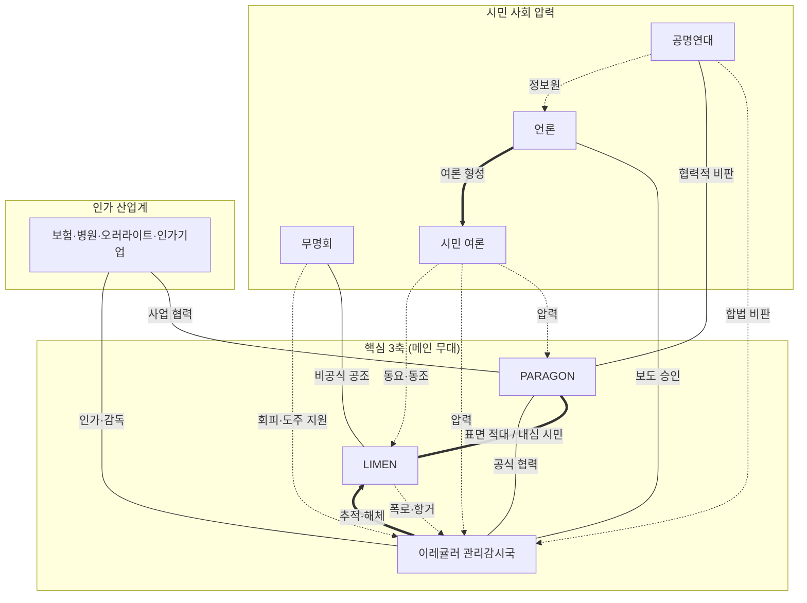

# 세력 간 관계도

> 뉴 센티넬의 모든 세력은 서로를 다르게 본다. 같은 사건도 누구의 입을 거치느냐에 따라 정의·범죄·혁명·테러로 바뀐다. 이 문서는 그 시선의 차이를 정리해, 캐릭터가 자기 진영의 입으로 사건을 해석할 수 있게 한다.

---

## 1. 한눈에 보는 큰 구도

화살표 의미:
- `===` 강한 적대 (양방향)
- `---` 협력·연결 (양방향)
- `==>` 통제·압박 (단방향)
- `-.->` 비공식·간접 영향

---

## 2. 등장 세력 카드

### 핵심 3축

#### [[PARAGON]]

> **USNA 공인 히어로 기관.** 한때 국제 조직이었으나 [[스카이룸]] 결전 이후 [[뉴 센티넬]] 중심으로 축소.

- **명분**: 시민을 지킨다. 위협에 가장 먼저 대응하는 자가 영웅이다.
- **결함**: 정부와 유착, 약물 의혹, 청산파·안정파 내부 분열. 모범이라는 이름의 무게가 부담이 됨.
- **러너 캐릭터 후크**: C·B·A 등급 현장 요원, 청산파·안정파·현장파·이탈자 4노선

#### [[LIMEN]]

> **REVOKE의 잔향이 재편된 경계의 네트워크.** 단일 조직이 아니라 느슨한 공조망. 미등록자 보호, 감시 회피, 진실 폭로가 활동 축.

- **명분**: 등록·면허·6조 정보 통제는 시민의 자유를 빼앗는다. 자기 결정권을 되찾는다.
- **결함**: 폭로 과정에서 민간 피해 발생 가능. 분파(잔향·문지기·절단자·회수자·더스트러너)마다 노선 충돌. 내부 통제 약함.
- **러너 캐릭터 후크**: 미등록 이레귤러, 등록 후 이탈자, 가족 보호자, 정보 절단자

#### [[이레귤러 관리감시국]]

> **USNA 연방 행정기관. [[이레귤러 안전 관리법]]의 집행 주체.** 플레이어블 진영이 아니라 도시의 법·기록·봉쇄로 작동하는 환경 장치.

- **명분**: 폭주 사고를 줄이고 시민을 보호한다. 법은 만인 앞에 평등하다.
- **결함**: 시행령과 내부 가이드라인이 정권·여론에 휘둘림. 사건 책임을 등록자에게 떠넘기는 구조적 편향. 6조 정보 통제로 자기 비리를 은폐 가능.
- **러너 캐릭터 후크**: 플레이어블 아님 (NPC). 단, 관리감시국 출신·전직·내부 고발자는 러너 캐릭터 가능

### 시민 사회 압력

#### [[공명연대]]

> **등록 이레귤러 중심의 합법 권익단체.** 안전 관리법 자체는 인정하되 운용의 부패와 6조 정보 통제의 위헌성을 비판.

- **명분**: 법치 안에서 권리를 되찾는다. 폭력이 아닌 입법·소송·언론으로.
- **결함**: 합법 노선이라 LIMEN의 절박함과는 거리가 있음. 강경파·온건파 분열 잠재.
- **러너 캐릭터 후크**: 변호사·로비스트·활동가·피해자 가족·당사자 모임 익명 회원
- 본문: [[공명연대]]

#### [[무명회]]

> **미등록 이레귤러 지원 비공식 네트워크.** [[LIMEN]] 합법 노선과 인적 교류 / [[공명연대]]와 의도적 불투명 / 합법·불법의 경계.

- **명분**: 등록 이전에 사람이 먼저다. 살아남게 한다.
- **결함**: 비공식이라 책임 구조가 약함. 셀 침투·악용 위험. 활동자의 번아웃 누적.
- **러너 캐릭터 후크**: 의료 셀·위장 셀·운송 셀·임시 브로커·의뢰인·셀 출신 캐릭터
- 본문: [[무명회]]

#### 언론·미디어

> **사건 보도의 1차 채널.** [[이레귤러 안전 관리법]] 6-1조 (보도 승인제)에 묶임. 표면적으로는 객관 보도, 실제로는 관리감시국의 승인 범위 안에서 움직임.

- **명분**: 시민에게 진실을 전한다.
- **결함**: 승인 거부 시 보도 불가. 광고주(인가 민간기업)와 정부 양쪽 눈치. 자유 매체와 어용 매체로 갈림.
- **러너 캐릭터 후크**: 기자·편집장·프리랜서·시민 기자

#### 시민 여론

> **개별 인물이 아닌 다극 집합.** [[감시도와 여론 시스템|4변수]]로 운영. 가장 큰 압력이자 가장 변덕스러운 변수.

- **명분**: 안전·자유·생활 안정.
- **결함**: 폭주 사고 직후엔 안전 우선, 폭로 직후엔 자유 우선으로 흔들림. 일관성 없음.
- **러너 캐릭터 후크**: 일반 시민·SNS 인플루언서·평범한 직장인·학생

### 인가 산업계

#### 민간기업 (보험·병원·오러라이트·인가 기업)

> **법의 그늘에서 돈을 버는 합법 영역.** PARAGON 협력업체, 이레귤러 전용 보험, 오러라이트 정제업, 인가 의료기관 등.

- **명분**: 시장이 안전을 떠받친다. 일자리와 안정.
- **결함**: 폭주 사고 보험금 거부, 이레귤러 우대 고용으로 일반 시민과의 격차, 약물 의혹 연루된 제약사.
- **러너 캐릭터 후크**: 보험 조사관·병원 의료진·산업계 연구원·기업 임원

### 잠재·미정 세력

- **신흥 세력** *(미정)* — 0_MOC에 등록만, 본문 미작성
- **외국 정부·외국 이레귤러 단체** — 90일 등록 의무 조항 관련, 외교 마찰 잠재
- **학계·연구계** — 제어제·증폭제 의혹, 등록 데이터 인용 제한과 충돌

---

## 3. 양방향 관계 매트릭스

같은 두 세력이라도 **누가 누구를 보느냐**에 따라 시선이 다르다. 행이 "보는 주체", 열이 "보이는 대상".

| ↓ 보는 주체 / 대상 → | PARAGON | LIMEN | 관리감시국 | 공명연대 | 무명회 | 언론 | 민간기업 | 시민 여론 |
| --- | --- | --- | --- | --- | --- | --- | --- | --- |
| **PARAGON** | — | 표면 적대 / 시민도 됨 | 공식 협력 / 속내 거리 | 협력적 거리 | 추적 대상 | 신중한 보도 협력 | 사업 파트너 | 모셔야 할 주인 |
| **LIMEN** | 표면 적 / 내심 동지 가능 | — | 항거·해체 표적 | 미온적 신뢰 | 우호·공조 | 폭로 채널 | 일부 적·일부 거래 | 깨워야 할 시민 |
| **관리감시국** | 활용·통제 | 추적·제거 | — | 정책 협의 대상 | 적대·해체 표적 | 통제·승인권 | 공인·감독 | 안심시켜야 할 대상 |
| **공명연대** | 비판적 동맹 | 거리두기 | 정책 압박 | — | 비공식 협력 | 활용 | 보호 요구 | 설득 대상 |
| **무명회** | 회의적 | 신뢰·연대 | 회피·저항 | 노선 공유 | — | 신중 접촉 | 거리 | 보호 대상 |
| **언론** | 협력·감시 | 취재·폭로 | 의존·통제받음 | 정보원 | 신중 접촉 | — | 광고주 관계 | 호객 대상 |
| **민간기업** | 사업 협력 | 위험 회피 | 인가받음 | 거리 | 무관 | 광고 채널 | — | 소비자 |
| **시민 여론** | 변덕스러운 신뢰 | 변덕스러운 동정 | 변덕스러운 복종 | 무관심 또는 지지 | 무지 또는 동조 | 의심·열광 교차 | 일상 의존 | — |

---

## 4. 세력별 입장 카드 — 진영의 입으로 말하기

각 세력 인물이 다른 세력을 언급할 때 쓸 수 있는 정형 화법 (안정파·청산파 등 노선별 변형 포함).

### PARAGON가 말할 때

- **LIMEN을 두고**
  - 안정파: "법 바깥에 선 위협. 그들이 옳다고 해도 방법이 틀렸다."
  - 청산파: "방법이 틀렸지만 동기까지 틀린 건 아니다. 우리도 같은 질문을 받고 있다."
  - 현장파: "현장에서 만나면 적이다. 그 외엔 모르겠다."
- **관리감시국을 두고**
  - 안정파: "우리의 권한 근거. 비판은 내부 채널로."
  - 청산파: "기준 위에 있어야 할 것이 정치 도구가 됐다."
- **공명연대를 두고**
  - "우리를 비판하지만 우리를 부정하진 않는다. 들을 만한 비판이다."

### LIMEN이 말할 때

- **PARAGON을 두고**
  - 잔향: "그들도 우리처럼 시작했다. 다만 갇혔을 뿐."
  - 문지기: "현장에서 부딪히는 이들은 시민이다. 사령부가 적이다."
  - 절단자: "기록이 그들의 무기다. 우리는 기록을 끊는다."
- **관리감시국을 두고**
  - "법으로 포장된 목줄. 풀거나 끊거나."
- **무명회를 두고**
  - "공식적으로는 모른다. 비공식적으로는 가족이다."

### 관리감시국이 말할 때

- **PARAGON을 두고**: "공인 협력 기관. 우리의 손과 발."
- **LIMEN을 두고**: "테러 조직. 시민 안전을 위협하는 미등록 위험군."
- **공명연대를 두고**: "합법적 비판 채널. 협의 가능한 상대."
- **무명회를 두고**: "조직적 실체 없음. 다만 우리의 미등록자 추적을 방해함."

### [[공명연대]]가 말할 때

- **PARAGON을 두고**
  - 온건파: "우리가 키운 영웅이지만 그들도 시민에게 책임을 진다."
  - 강경파: "[[PARAGON]] 청산파가 진심이라면, 자기 조직부터 정리해야 한다."
- **관리감시국을 두고**: "법은 시민 위에 있지 않다. 운용을 바꿔야 한다."
- **LIMEN을 두고**
  - 온건파: "우리는 같은 목표를 다른 방법으로 본다. 우리는 멈춰야 한다고 본다."
  - 강경파: "우리가 합법으로 못 지킨 사람을, 그들이 다른 방식으로 지킨다."
- **무명회를 두고**: "우리는 그들을 모른다. 그들도 우리를 모른다. 그래야 둘 다 산다."

### [[무명회]]가 말할 때

- **모두에게**: "등록 이전에 사람이 먼저다."
- **LIMEN을 두고**
  - 인도주의 노선: "그들의 분노는 우리의 일이 아니다."
  - 저항 노선: "그들이 우리를 지켜준다. 우리도 그들을 지킨다."
- **공명연대를 두고**: "그들이 못 받는 사람을 우리가 받는다. 그들을 부르기 전에 우리에게 와도 된다."
- **관리감시국을 두고**: "이름을 묻지 않으면 우리도 답하지 않는다."

---

## 5. 갈등 시나리오 12가지 — RP 후크

이벤트 시작 시 운영자가 던지는 표면 사건과, 그에 대한 각 세력의 반응. 캐릭터가 "내 진영은 어떻게 움직이는가"를 즉시 파악할 수 있게 정리.

### 5.1 폭주 사고 발생

- **PARAGON**: 현장 출동. 안정파는 즉각 진압, 청산파는 원인 조사 병행 주장.
- **관리감시국**: 구역 봉쇄, 보도 승인 보류, 사상자 명단 비공개 (6-4조).
- **LIMEN 문지기**: 폭주자가 약물 피해자일 가능성 탐색. 신원 보호 시도.
- **공명연대**: 책임 추궁 성명. "또다시 사후 대응인가."
- **언론**: 보도 승인 대기. 야간 SNS에 비공식 정보 흘러나옴.

### 5.2 미등록 이레귤러 발견

- **PARAGON 안정파**: 즉시 관리감시국 통보.
- **PARAGON 청산파**: 통보 전 사정 청취 시도. 보증인 설정 가능성 검토.
- **관리감시국**: 등록 강제, 면허 없음을 이유로 활동 제한.
- **LIMEN 회수자**: 본인 의사 확인 후 도주 지원.
- **무명회**: 신원 보호, 의료·은신처 제공.
- **6-5조 적용**: 일반 시민이 신원을 폭로하면 시민 측이 처벌 대상.

### 5.3 LIMEN의 언론 폭로 사건

- **LIMEN 절단자**: 감시 로그 또는 등록 데이터 유출.
- **관리감시국**: 6-2조 적용, 유출 경로 추적, 6-1조로 보도 매체 압박.
- **언론**: 자유 매체는 위험 감수 보도, 어용 매체는 침묵.
- **공명연대**: 폭로 내용의 위헌성 부각, 변호 제공.
- **PARAGON 청산파**: 사실관계 확인 후 동조 가능. 안정파는 적극 차단.

### 5.4 면허 정지 항의

- **당사자**: PARAGON 출신 또는 일반 등록 이레귤러.
- **공명연대**: 행정 소송 지원, 시민 청원 조직.
- **LIMEN**: 회유 시도 (특히 잔향). "그것 봐라."
- **관리감시국**: 추가 제재로 압박, 단 여론 변동에 따라 재심 허용 시점 결정.
- **시민 여론**: 폭주 이력 있는 인물이면 안전 우선, 무고하면 자유 우선으로 분기.

### 5.5 응급 동원 명령 거부

- **당사자**: 등록 이레귤러 (PARAGON 외 일반 등록자도 포함).
- **개인 사유**: 가족 보호, 정치적 양심, 신체 상태 등.
- **관리감시국**: 면허 정지·형사 제재 검토.
- **PARAGON 현장파**: 동원 거부 사유에 따라 사적 변호 가능.
- **공명연대**: 거부권 입법 운동의 사례로 활용.

### 5.6 사건 은폐 의혹 (화이트 아카이브·스카이룸 아카이브 관련)

- **단서 누출**: 학자, 전직 관리감시국 직원, 청산파 내부 고발자.
- **관리감시국**: 6-2조 적용, 누출자 추적·은폐 가속.
- **LIMEN 절단자**: 단서 확보, 폭로 시점 조율.
- **PARAGON 청산파**: 내부 조사 요청, 안정파와 정면 충돌.
- **무명회**: 누출자 신변 보호.
- **시민 여론**: 사건이 폭로되면 안전 우선 흐름 일시 붕괴.

### 5.7 대규모 민간 피해 발생

- **관리감시국**: 시행령 강화, 동원 명령 확대, 거주 제한 강화 추진.
- **PARAGON**: 신뢰도 큰 폭 변동 — 보호 성공 시 +, 실패 시 –.
- **LIMEN**: 명분 동요. "우리가 폭주를 막을 수 있었다 vs 막을 수 없었다."
- **공명연대**: 양면 압박 — 안전 강화 반대 + 피해자 보상 요구.
- **민간기업**: 보험금 지급 논란, 인근 사업체 영업 손실 소송.

### 5.8 외국 이레귤러 입국 사건

- **90일 등록 의무**: 외국 면허와 USNA 면허의 등급 불일치 발생 가능.
- **외국 정부**: 자국민 보호 요구, 외교 협의.
- **관리감시국**: 등록 강제, 일부는 외교 면책으로 처리.
- **LIMEN**: 미등록 외국인 이레귤러 보호망 가동.
- **공명연대**: 등록 의무 자체의 국제 표준 문제 제기.

### 5.9 시민 시위 발생

- **주도**: 공명연대 또는 자발적 시민 모임.
- **언론**: 보도 승인 가이드라인 안에서 보도.
- **관리감시국**: 시위 자체는 불법 아님. 단, 미등록자 참여 적발 시 다른 명목 적용.
- **PARAGON 현장파**: 시민 보호 명목으로 현장 배치.
- **LIMEN**: 직접 참여하지 않되 후방 지원.

### 5.10 민간기업 비리 발견

- **사례**: 보험금 조직적 지급 거부, 인가 제약사의 약물 의혹 연루.
- **언론**: 보도 가능 (보도 승인 받기 쉬움 — 정부에 부담 적음).
- **공명연대**: 집단 소송 조직.
- **관리감시국**: 인가 취소 검토.
- **PARAGON**: 해당 기업이 협력업체였다면 신뢰 타격.

### 5.11 PARAGON 내부 비리 폭로

- **누가**: 청산파 자체 또는 LIMEN과의 비공식 협조.
- **언론**: 6-1조에 묶여 승인 거부 가능. 자유 매체가 위험 감수.
- **관리감시국**: 6-2조 적용 vs 사건 자체 조사 사이 갈등.
- **공명연대**: 외부 압력 전면 가동.
- **시민 여론**: PARAGON 신뢰도 단기 –, 후반 정의 이미지 +로 분기 가능.

### 5.12 LIMEN 내부 분파 충돌

- **사례**: 절단자의 폭로 직전, 잔향이 민간 피해 우려로 반대.
- **표면화**: 내부 충돌이 외부로 누출되면 관리감시국의 분리 공작 기회.
- **PARAGON 현장파**: LIMEN의 약점으로 활용.
- **무명회**: 중재 시도, 일부 분파만 지지.

---

## 6. 회색지대와 이중성

진영 매트릭스로 깔끔히 분류되지 않는 인물 유형. 캐릭터 설정에 깊이를 주는 영역.

### 진영을 오가는 인물

- **PARAGON 이탈자**: 면허 정지·내부 고발로 LIMEN 또는 무명회와 협력
- **LIMEN 출신 등록자**: PARAGON 보증인을 통해 등록한 후 이중 정보원
- **관리감시국 내부 고발자**: 6-2조 위반 위험을 안고 누출
- **공명연대 변호사 ↔ LIMEN 절단자**: 합법 변호와 불법 폭로를 같은 사람이 함

### 같은 진영 내부의 분열

- **PARAGON 4노선**: 청산파·안정파·현장파·이탈자. 같은 이름 아래 다른 진영처럼 행동.
- **LIMEN 5분파**: 잔향·문지기·절단자·회수자·더스트러너. 노선 충돌은 외부 공격보다 자주 발생.
- **관리감시국 내부**: 강경파·온건파·실무파의 미묘한 차이.

### 캐릭터가 갈팡질팡할 수 있는 지점

- 가족이 등록 이레귤러인데 본인은 미등록
- PARAGON 동료가 LIMEN과 비공식 협조 중
- 관리감시국 명령이 시민 보호와 충돌
- 폭로하면 정의지만 폭로 대상자가 가까운 사람

---

## 7. 시간에 따른 관계 변화

세력 관계는 고정되어 있지 않다. 사건이 흐름을 흔든다.

### 폭주 사고 직후

- 시민 여론: 안전 우선 → 관리감시국·PARAGON 신뢰 ↑, LIMEN 영향력 ↓
- 안전 관리법 강화 분위기, 6조 적용 강화
- 공명연대: 책임 추궁이 안전 강화에 묻힘

### LIMEN 폭로가 성공한 직후

- 시민 여론: 자유 우선 일시 회복 → 관리감시국 신뢰 ↓, LIMEN 영향력 ↑
- PARAGON 청산파 부상 기회
- 6조 운용에 대한 비판 여론
- 단, 폭로 과정에서 민간 피해가 동반되면 효과 반감

### 정권 변동·법 개정 시기

- 모든 관계 재설정
- 시민 권리 단체의 입법 영향력 ↑
- LIMEN 일부 합법화 시도 가능 (잔향 노선)

### 챕터 진행에 따른 누적

- [[감시도와 여론 시스템|시민 여론 4변수]]의 누적 변화가 진영 관계의 무게를 옮김
- 운영자는 4변수 변동을 진영 관계 흐름으로 번역해서 뉴스·이벤트에 반영

---

## 8. 미결정 항목

이 문서는 다음 항목이 확정되면 갱신된다.

- **신흥 세력** — 0_MOC에만 등록, 본문 미작성.
- **외국 정부·외국 이레귤러 단체** — 1차 러닝에서는 배경 압력으로만 사용 예정.
- **학계·연구계** — 제어제·증폭제 의혹 관련 캐릭터화 미정.

### 확정 이력

- 2026-05-22: 공명연대·무명회 본문 확정 ([[공명연대]] / [[무명회]])

---

## 9. 운영진 참고

- 사건 결과 카드 작성 시 이 문서의 시나리오 12가지를 템플릿으로 사용 가능.
- 진영별 입장 카드는 NPC 대사 작성에 직접 활용.
- 6장 회색지대는 신청서 검수 단계에서 캐릭터 설정 